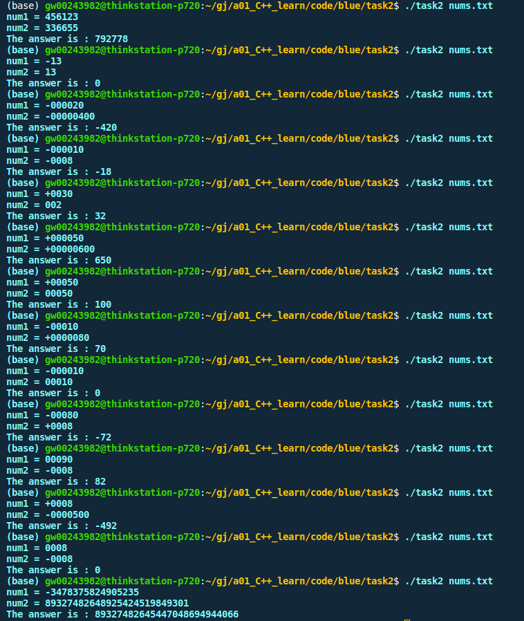
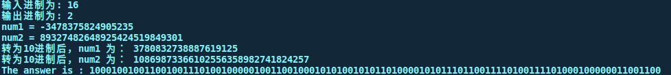
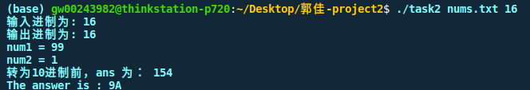

水平有限，尽力实现。

# quick start
```
sh run.sh
task2 nums.txt base_in base_out // base_in 为输入进制数，base_out 为输出进制数
```

# 功能
- 接收命令行传入参数
- 打开txt文件，无法正确打开就报错，读取txt文件中的内容 `read_file`
- 接收txt文件前两行数据，并执行 `ope`：
    - 输入数据处理：去符号、去前置0 `del_zero`、进制转换 `n_to_ten`
    - 根据输入数据的符号判断调用加法 `add_`、减法 `minus_`、或者直接给ans赋0
    - 输出数据处理：判断时候去前置0 `del_zero`、加负号、进制转换 `ten_to_n`
- 打印输出结果

# 代码解释
- `del_zero`: 从第一位向后统计连续零的数量，根据数量剔除数据中的前置0
- `compare_`： 比较去符号、去0后的num1与num2，永远让num1表示大数；函数返回不同int值，方便后续判断是否给结果加负号
- `add_`： 将num1与num２反转，从第一位开始遍历，逢10进１，依次将每一位的结果添加到答案中，判断最后一位是否进1，是否在答案中添加1，答案翻转
- `minus_`：将num1与num２反转，从第一位开始遍历，若被减数小，则借1，后一位被减数减1，依次将每一位的结果添加到答案中，答案翻转
- `n_to_ten`:预处理，将高进制的符号转为int整数存起来，依次遍历进行进制转换，最后统一转为string格式
- `ten_to_n`:依次遍历进行进制转换，判断是否转为A-Z符号或者直接转为char型，最后返回string格式


# 工程目录
```
.
├── CMakeLists.txt
├── main.cpp     -----主程序
├── nums.txt     -----主程序接收的测试文件
├── ope.cpp     -----功能程序
├── ope.h
├── pic
│   ├── cuts2.png     -----运行截图
│   └── cuts.png     -----运行截图
|   └── cuts3.png     -----运行截图
├── readme.md
├── run.sh     -----编译脚本
└── task     -----编译好的可执行文件
```
# 运行截图
运行截图与如下： 



