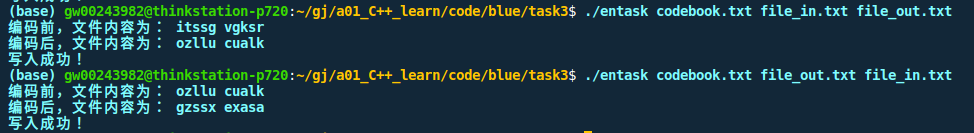

水平有限，尽力实现。

# quick start
```
sh run.sh
entask code.txt file_in.txt file_out.txt // 编码任务，code.txt为码本，file_in.txt和file_out.txt分别为编码前文件和编码后文件
detask code.txt file_in.txt file_out.txt // 解码任务，code.txt为码本，file_in.txt和file_out.txt分别为解码前文件和解码后文件
```

# 功能
- 读取码本，读取输入文件
- 进行编码或解码任务
- 将编/解码后内容写入输出文件

# 代码解释
- `OPE::encode`: 遍历读取的输入文件内容，若内容不属于 a-z, 直接添加到输出变量；若属于，则求出该内容的索引，在码本中索引到对应的密文，添加到输出变量并返回
- `OPE::decode`: 遍历读取的输入文件内容，若内容不属于 a-z, 直接添加到输出变量；若属于，则在码本中找到其对应的索引，根据索引确定a-z对应的char值，添加到输出变量并返回


# 工程目录
```

```
# 运行截图
运行截图与如下： 


