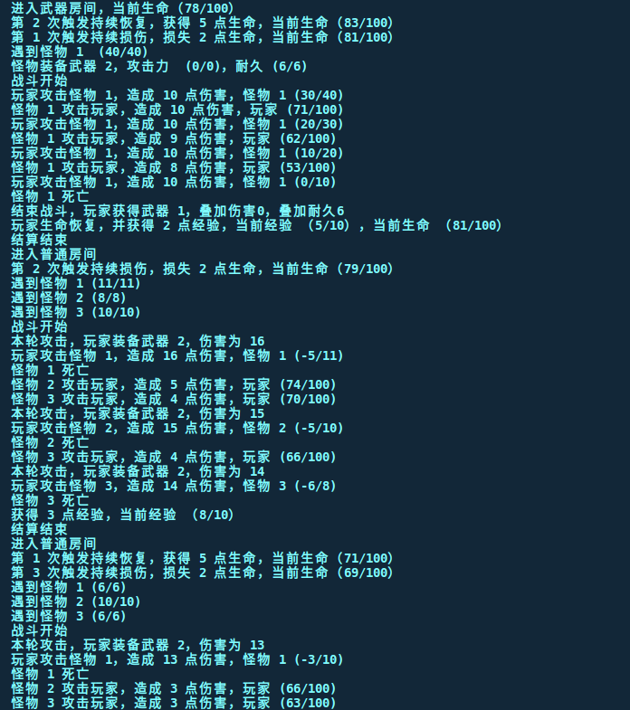

# quick start
```
sh run.sh
./task2
```

# 功能
- 所有功能自测均已实现

# 工程目录
```
.
├── CMakeLists.txt 
├── main.cpp // 主文件
├── main.h
├── pic1.png // 运行截图
├── readme.md
├── role_base.cpp // 角色基类
├── role_base.h
├── role.cpp // 角色类
├── role.h
├── room_base.cpp // 房间基类
├── room_base.h
├── room.cpp // 房间类
├── room.h
├── run.sh 
└── task4 // 编译好的可执行文件

```
# 运行截图
运行截图与如下： 


